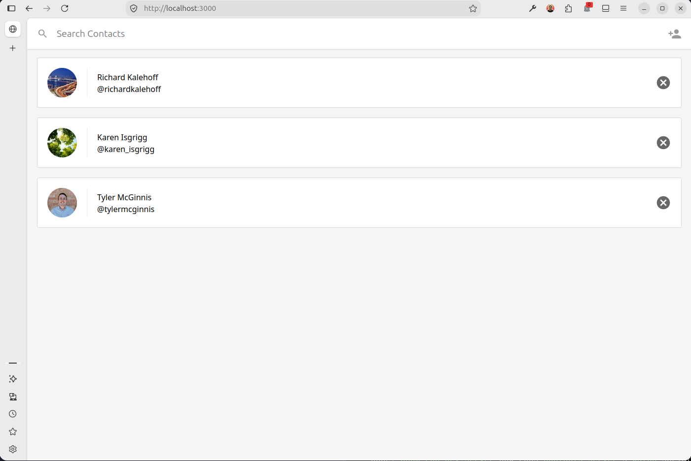
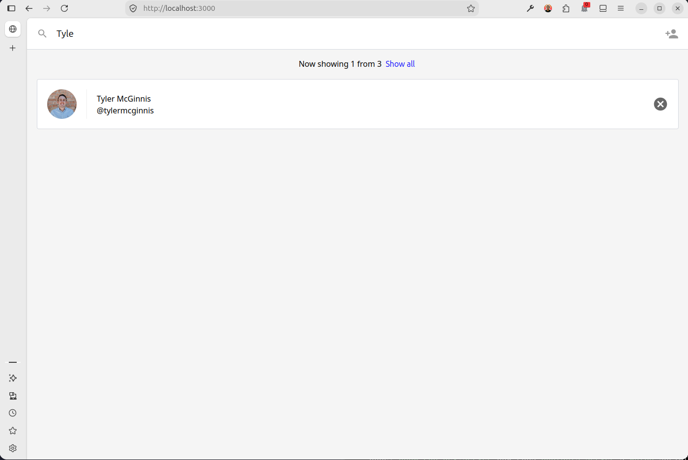
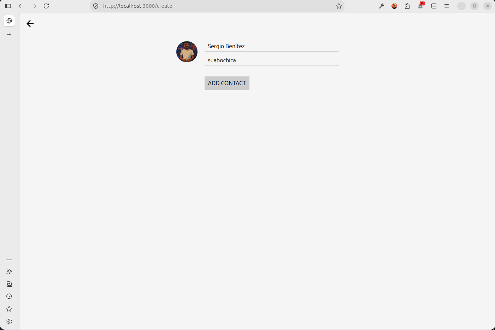

Contacts
========

Contacts app built with React as a playground project.



## Folder structure

This project is composed by two parts:

- `/client` - Frontend of the application built with React.
- `/server` - Backend of the application built with Node and Express.

## Launch

From the root of this folder (`packages/04-contacts`), install dependencies:

```bash
pnpm install
```

Then run both client and server in development mode:

```bash
pnpm run dev:server
pnpm run dev:client
```

The server runs on `http://localhost:5001` and the client on `http://localhost:3000`.

### Search contacts



### Add a contact


